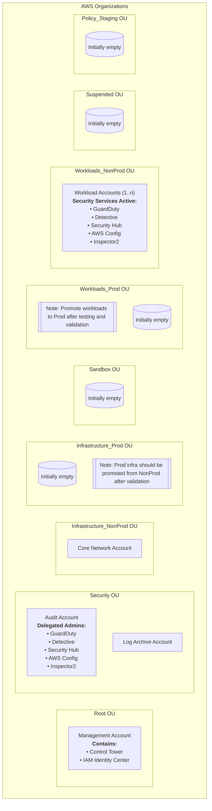

# DoD Zero Trust CSPM

This repository implements the CSPM (Cloud Security Posture Management) component used in our Cloud Native SCCA (CNSCCA) product architecture. Important notes:

- CNSCCA (Cloud Native SCCA) is an overarching product that integrates multiple components into a full SCCA solution (orchestration, pipelines, policy automation and documentation). CNSCCA is a separate project and is not contained in this repository.
- CNAP-AWS is a separate project that implements the core networking and workload platform (VPCs, TGW, SDN, Network Firewall, WAF, load balancing, etc.). It is not part of this repository.
- `terraform-aws-cspm` (this repo) provides the CSPM/security service implementation and multi-account security patterns (GuardDuty, Security Hub, Detective, Inspector2, AWS Config, etc.).

If you want to learn more about CNSCCA or CNAP-AWS, please contact the maintainers or open an issue in this repository and we'll connect you with the appropriate project owners. This repo focuses on the CSPM modules and patterns; orchestration of the full SCCA (CNSCCA) combines this repository with other projects such as CNAP-AWS.


## Module Architecture

This implementation provides 8 specialized modules:

**Foundation Modules**
- `organizations` - Multi-account structure and OU management
- `sso` - Centralized identity and access control via IAM Identity Center
- `controltower` - Governance and compliance baseline

**Security Services**
- `guardduty` - Threat detection and monitoring
- `detective` - Security investigation and analysis
- `securityhub` - Centralized security findings aggregation
- `awsconfig` - Configuration compliance and drift detection
- `inspector2` - Vulnerability assessment

All security services use the audit account as delegated administrator with automatic member account enrollment.

After deployment is complete your AWS Organization will look like this:



## Prerequisites

### Checklist

- [ ] **AWS Management Account Access**: OrganizationFullAccess permissions
- [ ] **OpenTofu 1.6+**: This project uses OpenTofu (not Terraform)
- [ ] **AWS CLI**: For account creation (required first step)
- [ ] **OrganizationAccountAccessRole**: Cross-account roles in each member account with trust relationships to the management account
- [ ] **Account Planning**: Review and modify YAML configuration structure in `examples/inputs/` to suit your organization

### 1. Create AWS Organization

In your AWS Management Account, create an AWS Organization if you do not already have one. This can be done via the AWS Management Console or AWS CLI. See the [AWS documentation](https://docs.aws.amazon.com/organizations/latest/userguide/orgs_tutorials_basic.html#tutorial-orgs-step1) for guidance.

### 2. Create AWS Accounts

> [!IMPORTANT]
> AWS accounts MUST be created via AWS Organizations CLI before any OpenTofu management.

This project does not enforce any specific naming conventions on accounts. We recommend a consistent pattern for clarity and organization. For example:

- Pattern: `{YourOrg}-{Function}-{Lifecycle}`
- Examples: "ACME-LogArchive-Prod", "ACME-Audit-Prod", "ACME-Workload-Prod1", "ACME-Network-NonProd", "ACME-Management-Prod"
- GovCloud Note: Account names cannot be changed in GovCloud partition

Create the minimum required accounts first: management, log archive, and audit. Additional accounts can be created later as needed. See the [AWS documentation](https://repost.aws/knowledge-center/create-govcloud-account) for guidance. For every account, record the following information for input into the OpenTofu configuration:

- Account Name
- Account Email
- Account ID (after creation)
- Account Type (management, log_archive, audit, workload, network, etc.)


### 3. Prepare Inputs

Review the samples inputs in `examples/` and modify as needed for your organization. The key files to review are:
- `examples/inputs/` - YAML configuration files defining accounts, OUs, and role mappings
- `examples/variables.tf` - Define global variables like project name, region, and tags
- `examples/main.tf` - Main deployment logic and module invocations


## Initial Deployment

### Deployment Strategy

The modular architecture requires foundation services to be deployed before security services. The `examples/main.tf` handles dependencies automatically, but you can deploy in phases for better control. We recommend including a [target file](https://opentofu.org/docs/cli/state/resource-addressing/#resource-addresses-in-targeting-files) in your repo to control the deployment order. This pattern is especially useful in environments where you don't have the ability to pass `-target` flags directly in CLI commands.

#### Phase 1: Foundation Services (Required First)
```bash
cd examples/
tofu init

# In your target file, uncomment foundation modules one at a time
module.organizations
module.controltower_admin
module.sso

# Deploy core foundation
tofu apply
```

#### Phase 2: Security Services
```bash

# In your target file, uncomment modules one at a time
module.guardduty
module.detective
module.securityhub
module.awsconfig_admin
module.awsconfig_members
module.inspector2

# Deploy security services
tofu apply
```

### Expected Deployment Timeline

| Phase | Duration | Key Activities |
|-------|----------|----------------|
| **Foundation** | ~45 minutes | OU creation, Control Tower landing zone, SSO setup |
| **Security Services** | ~60 minutes | Organization-wide service enablement, delegated admin setup |
| **Stabilization** | up to 24 hours | Cross-account enrollment, initial data collection |


### Post-deployment steps

#### GuardDuty

**Note:** Enabling member accounts is not retroactive — you must enable member accounts manually after initial setup.

Steps:
1. Login to the audit account and navigate to the GuardDuty console.
2. In the left-hand navigation, go to **Accounts**.
3. Verify the **Status** column for each account shows **Enabled**.
4. If any account is not enabled, select the checkbox next to the account(s) → **Actions** → **Add member**.

#### Detective

**Note:** Enabling member accounts is not retroactive — you must enable member accounts manually after initial setup.

Steps:
1. Login to the audit account and navigate to the Detective console.
2. In the left-hand navigation, go to **Settings → Account management**.
3. Verify the **Status** column for member accounts shows **Enabled**.
4. If accounts are not enabled, click **Enable all accounts**.

#### Inspector

No action required.

#### Control Tower

No action required.

If you need to enroll or onboard existing accounts into Control Tower later, see:

- [Enroll an existing AWS account (AWS Docs)](https://docs.aws.amazon.com/controltower/latest/userguide/enroll-account.html)
- [Field Notes: Enroll Existing AWS Accounts into AWS Control Tower (AWS Blogs)](https://aws.amazon.com/blogs/architecture/field-notes-enroll-existing-aws-accounts-into-aws-control-tower/)

#### Security Hub

No action required.

Insight categories for Critical and High findings are automatically configured. You may wish to fine-tune Security Standard controls to reduce noise for your environment.

#### Config

No action required.

#### CloudTrail

No action required.

#### IAM Identity Center

No action required.

By passing the default `use_self_managed_sso  = true` to the SSO module, IAM Identity Center will be instantiated according to the module logic and _not_ by Control Tower. This project intentionally keeps IAM Identity Center administration in the management account rather than delegating it to another account. Delegation is possible but should only be used for specific, well-justified use cases because the management account has the highest level of permissions.

Customizations to IAM Identity Center (for example, switching to an external identity provider) can be applied separately; refer to the AWS documentation for guidance.

## Destroy and End-of-Life Guidance

`terraform destroy` or `tofu destroy` is NOT sufficient to fully clean up all AWS resources created by this module. The AWS Provider has inherent limitations and does not implement complete destroy logic for many AWS services, particularly organizational and security services.

For complete environment cleanup, use aws-nuke: https://aws-nuke.ekristen.dev/

## References

This project incorporates best practices and patterns from multiple sources, as well years of experience building and authorizing secure AWS environments. The design is heavily influenced by the AWS Security Reference Architecture (AWS SRA) and the AWS Landing Zone Accelerator, adapted to meet DoD Zero Trust requirements and based on lessons learned from real-world deployments.

**Key references:**
- [AWS Security Reference Architecture (AWS Docs)](https://docs.aws.amazon.com/prescriptive-guidance/latest/security-reference-architecture/architecture.html)
- [AWS Landing Zone Accelerator (AWS Docs)](https://docs.aws.amazon.com/solutions/latest/landing-zone-accelerator-on-aws/solution-overview.html)
- [AWS Multi-Account Strategy for AWS Control Tower Landing Zone](https://docs.aws.amazon.com/controltower/latest/userguide/aws-multi-account-landing-zone.html)
- [AWS Config Best Practices](https://aws.amazon.com/blogs/mt/aws-config-best-practices/)
- [Amazon GuardDuty Security Best Practices](https://aws.github.io/aws-security-services-best-practices/guides/guardduty/)
- [Amazon Inspector Security Best Practices](https://aws.github.io/aws-security-services-best-practices/guides/inspector/)
- [Amazon Detective Security Best Practices](https://aws.github.io/aws-security-services-best-practices/guides/detective/)
- [AWS Security Hub Security Best Practices](https://aws.github.io/aws-security-services-best-practices/guides/securityhub/)
- [AWS Prescriptive Guidance for Secure Cloud Computing Architecture on AWS for the US Department of Defense](https://docs.aws.amazon.com/prescriptive-guidance/latest/secure-architecture-dod/scca-components-and-requirements.html)
