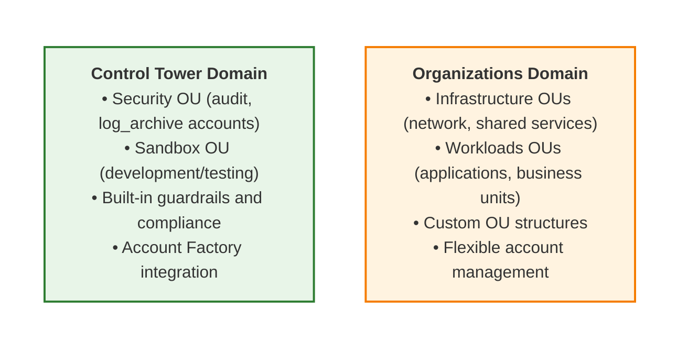
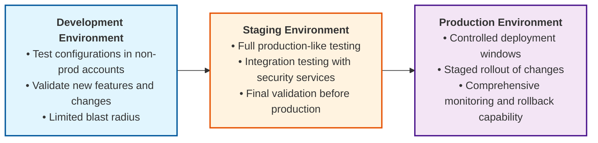

# Administrator Guide

**Setup, deployment, and configuration management** for terraform-aws-cspm modular security architecture.

## Quick Start Overview

The terraform-aws-cspm project provides specialized modules that deploy DISA SCCA-compliant security services across AWS multi-account environments. This guide covers initial setup, deployment procedures, and ongoing configuration management.

### Module Architecture Summary

| Layer | Modules | Purpose | Dependencies |
|-------|---------|---------|--------------|
| **Foundation** | organizations, controltower, sso | Multi-account structure, governance, identity | Must deploy first |
| **Security Services** | guardduty, detective, securityhub, awsconfig, inspector2 | Cross-account security monitoring | Requires foundation |

All security services use the **audit account as delegated administrator** for centralized management.

## Prerequisites Checklist

- [ ] **AWS Management Account Access**: OrganizationFullAccess permissions
- [ ] **OpenTofu 1.6+**: This project uses OpenTofu (not Terraform)
- [ ] **AWS CLI**: For account creation (required first step)
- [ ] **OrganizationAccountAccessRole**: Cross-account roles in each member account with trust relationships to the management account
- [ ] **Account Planning**: Review YAML configuration structure in `examples/config/`

## Account Creation Workflow (Required First)

> [!IMPORTANT]
> AWS accounts MUST be created via AWS Organizations CLI before any Terraform/OpenTofu management.

### Standard Account Creation Process

#### 1. GovCloud Accounts (Most Common for DoD)
```bash
# Set your management account profile
export AWS_PROFILE=your-govcloud-management-profile

# Core security accounts (required for Control Tower)
aws organizations create-gov-cloud-account \
  --account-name "YourOrg-Security-Audit" \
  --email "aws-audit@yourorg.com"

aws organizations create-gov-cloud-account \
  --account-name "YourOrg-Security-LogArchive" \
  --email "aws-logs@yourorg.com"

# Additional accounts as needed
aws organizations create-gov-cloud-account \
  --account-name "YourOrg-Network-Hub" \
  --email "aws-network@yourorg.com"
```

#### 2. Record Account Information
After each creation, record:
- Account ID (from API response)
- Account name (exactly as provided to CLI)
- Email address
- Intended OU placement

### Account Naming Best Practices
- **Pattern**: `{YourOrg}-{Function}-{Environment}`
- **Examples**: "ACME-Security-Audit", "ACME-Workload-Prod1", "ACME-Network-Hub"
- **GovCloud Note**: Account names cannot be changed in GovCloud partition

#### Configuration Alignment

> [!IMPORTANT]
> Use EXACT names and emails from CLI in YAML configuration:

```yaml
# -- examples/inputs/accounts.yaml --
audit_account:
  account_id: "123456789012"                  # From CLI response
  account_name: "YourOrg-Security-Audit"     # MUST match CLI exactly
  email: "aws-audit@yourorg.com"             # MUST match CLI exactly
  account_type: audit                         # AWS SRA account type
  ou: Security                                # OU placement
  lifecycle: prod                             # prod/nonprod
  additional_tags:
    Owner: "Security Team"
    Purpose: "Audit & Compliance"
    UIC: "123456"
```

The YAML configuration is automatically loaded and transformed by `examples/locals.tf` using `yamldecode()`.

## Initial Deployment

### Deployment Strategy

The modular architecture requires foundation services to be deployed before security services. The `examples/main.tf` handles dependencies automatically, but you can deploy in phases for better control. We recommend including a [target file](https://opentofu.org/docs/cli/state/resource-addressing/#resource-addresses-in-targeting-files) in your repo to control the deployment order. This pattern is especially useful in environments where you don't have the ability to pass `-target` flags directly in CLI commands.

#### Phase 1: Foundation Services (Required First)
```bash
cd examples/
tofu init

# In your target file, uncomment foundation modules only
module.organizations
module.controltower_admin
module.controltower_members
module.sso

# Deploy core foundation
tofu apply
```

**What This Provides:**
- AWS SRA organizational unit structure
- Control Tower landing zone with guardrails
- IAM Identity Center with persona-based access control
- Foundation for security services

#### Phase 2: Security Services (Automatic)
```bash

# In your target file, uncomment all remaining modules
module.guardduty
module.detective
module.securityhub
module.awsconfig_admin
module.awsconfig_members
module.inspector2

# Deploy all remaining services
tofu apply
```

**What This Deploys:**
- **guardduty**: Organization-wide threat detection (audit account as admin)
- **detective**: Security investigation capabilities
- **securityhub**: Centralized security findings aggregation
- **awsconfig**: Configuration compliance monitoring
- **inspector2**: Vulnerability management across accounts
- Cross-account service enrollment and configuration

### Expected Deployment Timeline

| Phase | Duration | Key Activities |
|-------|----------|----------------|
| **Foundation** | 10-20 minutes | OU creation, Control Tower landing zone, SSO setup |
| **Security Services** | 15-30 minutes | Organization-wide service enablement, delegated admin setup |
| **Stabilization** | 5-10 minutes | Cross-account enrollment, initial data collection |

**Total**: 30-60 minutes for complete organization setup

### Post-Deployment Verification

#### 1. Foundation Services
```bash
# Organizations structure
aws organizations list-organizational-units-for-parent --parent-id r-xxxx

# Control Tower status
aws controltower get-landing-zone --landing-zone-identifier <id>

# SSO configuration
aws sso-admin list-permission-sets --instance-arn <instance-arn>
```

#### 2. Security Services (Login to Audit Account)
- **GuardDuty**: Verify all accounts enabled under "Accounts"
- **Detective**: Check behavior graph shows member accounts
- **Security Hub**: Confirm organization configuration active
- **Config**: Verify organization-wide recorders running
- **Inspector2**: Ensure all accounts are enrolled

## Configuration Management

### YAML-Based Configuration Approach

The project uses declarative YAML files for account and organizational unit management, providing a cleaner separation between configuration and implementation.

#### Configuration Structure
```
examples/inputs/
├── accounts.yaml               # All account definitions
└── organizational_units.yaml   # Custom OUs beyond AWS SRA
```

#### Account Configuration Example
```yaml
# inputs/accounts.yaml
audit_account:
  account_id: "123456789012"
  account_name: "YourOrg-Security-Audit"  # Must match CLI creation exactly
  email: "aws-audit@yourorg.com"          # Must match CLI creation exactly
  account_type: audit                     # Used for SSO permission mapping
  ou: Security                            # Target OU placement
  lifecycle: prod                         # Lifecycle classification
  additional_tags:
    Owner: "Security Team"
    Purpose: "Security Audit & Compliance"
    UIC: "123456"
    # sso_groups: ["aws-sec-auditor", "aws-admin"]  # Example for future use

```
> [!IMPORTANT]
> **SSO Groups Parameter:**
> The `sso_groups` (or similar SSO-related parameters) in `accounts.yaml` are **reserved for future enhancements**.
> **Current behavior:** The SSO module (`modules/sso`) does **not** use these parameters. Group assignments and permission sets are determined by the account type system and module logic, not by values in the YAML configuration.

#### Integration with Terraform
The YAML configuration is loaded and transformed by `examples/locals.tf`:

```hcl
# Load account configuration from YAML file
raw_account_configs = yamldecode(file("${path.root}/inputs/accounts.yaml"))

# Transform to module format with consistent resource keys
aws_account_parameters = {
  for account_key, account_config in local.raw_account_configs :
  account_config.account_id => {
    name         = account_config.account_name
    email        = account_config.email
    ou           = account_config.ou
    lifecycle    = account_config.lifecycle
    account_type = account_config.account_type
    # ... additional transformations
  }
}
```

### Account Type System

Standardized account types enable consistent SSO permission assignments:

| Account Type | SSO Permissions | Purpose | Typical OU |
|-------------|----------------|---------|------------|
| `management` | aws-admin | Organization management | Root |
| `log_archive` | aws-admin, aws-cyber-sec-eng, aws-sec-auditor | Centralized logging | Security |
| `audit` | aws-admin, aws-cyber-sec-eng, aws-sec-auditor | Security monitoring | Security |
| `network` | aws-admin, aws-cyber-sec-eng, aws-net-admin, aws-power-user, aws-sec-auditor, aws-sys-admin | Network hub/transit | Infrastructure |
| `shared_services` | aws-admin, aws-cyber-sec-eng, aws-net-admin, aws-power-user, aws-sys-admin | Shared services | Infrastructure |
| `security_tooling` | aws-admin, aws-cyber-sec-eng, aws-sec-auditor | Security tools | Security |
| `backup` | aws-admin, aws-cyber-sec-eng, aws-sys-admin | Backup services | Infrastructure |
| `workload` | aws-admin, aws-power-user, aws-cyber-sec-eng, aws-sec-auditor, aws-sys-admin | Application hosting | Workloads |

## Architecture Understanding

### Hybrid Control Tower + Organizations Design

#### Why Hybrid Architecture?
- **Control Tower**: Manages Security/Sandbox OUs with built-in guardrails
- **Organizations**: Manages Infrastructure/Workloads OUs with flexibility
- **Best of Both**: Security baseline + organizational customization

#### Service Boundaries



## Access Management

### Administrator Access Patterns

#### Management Account Access
- **Purpose**: Organizational resource management
- **Scope**: Organizations, Control Tower, top-level services
- **Access Method**: Direct AWS credentials or SSO

#### Audit Account Access
- **Purpose**: Security service management and monitoring
- **Scope**: GuardDuty, Security Hub, Config, Detective, etc.
- **Access Method**: Cross-account role or SSO

#### SSO Configuration
The SSO module automatically creates permission sets and assigns them to accounts based on account types:

```hcl
# -- examples/main.tf --
module "sso" {
  source = "../modules/sso"

  project                   = var.project
  global_tags               = var.global_tags
  account_id_map            = local.account_id_map
  account_role_mapping      = local.account_role_mapping
  enable_sso_management     = true
  auto_detect_control_tower = true
  existing_admin_user_id    = "your-existing-user-id"

  # Optional: Create additional admin users
  # initial_admin_users = [
  #   {
  #     user_name    = "security.admin"
  #     display_name = "Security Administrator"
  #     email        = "security@your-company.com"
  #     given_name   = "Security"
  #     family_name  = "Administrator"
  #     admin_level  = "security"  # "full" or "security"
  #   }
  # ]
}
```

The module automatically assigns permission sets based on the account type system shown in the previous table.

### Security Considerations
- **Least Privilege**: Grant minimum necessary permissions
- **Separation of Duties**: Different roles for different functions
- **Regular Reviews**: Monthly access audits and updates
- **MFA Enforcement**: Multi-factor authentication required

## Provider Configuration

### Cross-Account Provider Pattern
Security services use cross-account role assumption for proper dependency management:

```hcl
# -- examples/versions.tf --
# Management account (default, inherited by each module if not overridden)
provider "aws" {
  region = local.region
}

# Audit account for security services
provider "aws" {
  alias  = "audit"
  region = local.region
  assume_role {
    role_arn = "arn:${data.aws_partition.current.partition}:iam::${local.audit_account_id}:role/OrganizationAccountAccessRole"
  }
}

# Log archive account
provider "aws" {
  alias  = "log_archive"
  region = local.region
  assume_role {
    role_arn = "arn:${data.aws_partition.current.partition}:iam::${local.log_archive_account_id}:role/OrganizationAccountAccessRole"
  }
}

# Dynamic providers for all non-management accounts
provider "aws" {
  for_each = local.non_mgmt_accounts_map
  alias    = "ct_exec"
  region   = var.aws_region
  assume_role {
    role_arn = "arn:${data.aws_partition.current.partition}:iam::${each.key}:role/AWSControlTowerExecution"
  }
}

# Pass to modules
module "guardduty" {
  source = "../modules/guardduty"

  providers = {
    aws.audit = aws.audit
  }

  depends_on = [module.controltower]
}
```

### AWS Credential Management

> [!IMPORTANT]
> **Production Recommendation**: This project is designed for CI/CD pipeline deployment in enterprise environments. Local development should be limited to testing and validation.

#### Pipeline Deployment (Recommended)
For production deployments, configure your CI/CD pipeline with management account credentials:

```yaml
# Example GitLab CI/CD variables
AWS_ACCESS_KEY_ID: ${MGMT_ACCOUNT_ACCESS_KEY}
AWS_SECRET_ACCESS_KEY: ${MGMT_ACCOUNT_SECRET_KEY}
AWS_DEFAULT_REGION: us-gov-west-1

# Example GitHub Actions
- name: Configure AWS credentials
  uses: aws-actions/configure-aws-credentials@v2
  with:
    aws-access-key-id: ${{ secrets.AWS_ACCESS_KEY_ID }}
    aws-secret-access-key: ${{ secrets.AWS_SECRET_ACCESS_KEY }}
    aws-region: us-gov-west-1
```

#### Local Development Setup
For testing and validation, you can use local profiles:

```bash
# ~/.aws/config example - Only management account profile needed
[profile cnscca-gov-mgmt]
region = us-gov-west-1
output = json

# Set as default for OpenTofu operations
export AWS_PROFILE=cnscca-gov-mgmt
```

**Key Points:**
- **Management Account Only**: You only need direct credentials for the management account
- **Cross-Account Roles**: Providers automatically assume roles in member accounts
- **OrganizationAccountAccessRole**: Created automatically when accounts join the organization
- **AWSControlTowerExecution**: Created by Control Tower for member accounts
- **Pipeline Security**: Store credentials as encrypted secrets in your CI/CD platform
- **Credential Rotation**: Implement regular rotation of pipeline credentials

## Customization and Extension

### Adding New OUs
Extend organizational units using the YAML configuration:

```yaml
# -- inputs/organizational_units.yaml --
# Standard OUs (automatically included)
# Infrastructure_Prod: { lifecycle: "prod" }
# Infrastructure_NonProd: { lifecycle: "nonprod" }
# Workloads_Prod: { lifecycle: "prod" }
# Workloads_NonProd: { lifecycle: "nonprod" }

# Custom additions - no code changes needed!
Research_Prod:
  lifecycle: prod
  description: "Research and development production workloads"

Development:
  lifecycle: nonprod
  description: "Development and testing environments"

Sandbox_Test:
  lifecycle: nonprod
  description: "Experimental and proof-of-concept workloads"
```

The YAML configuration is automatically loaded by `examples/locals.tf` and merged with standard AWS SRA organizational units.


## Deployment Strategies

### Environment Progression



### Change Management Process
1. **Planning**: Document changes and impact assessment
2. **Testing**: Validate in development/staging environments
3. **Approval**: Security and operations team review
4. **Deployment**: Staged deployment with monitoring
5. **Verification**: Confirm expected outcomes
6. **Documentation**: Update procedures and runbooks


## Troubleshooting

### Common Administrator Issues

| Issue | Symptoms | Solution | Prevention |
|-------|----------|----------|------------|
| **Account creation errors** | CLI failures | Check permissions and quotas | Regular quota monitoring |
| **Provider authentication** | Access denied | Verify profiles and roles | Credential rotation process |
| **Validation failures** | Terraform errors | Check configuration consistency | Use validation checklist |

### Diagnostic Tools
```bash
# Check Terraform configuration
tofu validate
tofu plan -detailed-exitcode

# Verify AWS access
aws sts get-caller-identity --profile cnscca-gov-mgmt
aws organizations describe-organization

# Test cross-account access
aws sts assume-role --role-arn CROSS_ACCOUNT_ROLE --role-session-name test

# Check service status
aws guardduty list-detectors --region us-gov-west-1
aws controltower get-landing-zone --region us-east-1
```

## Advanced Topics

### State Management
- **Remote State**: Use S3 backend or other compatible storage solutions
- **State Isolation**: Separate states for different environments
- **State Security**: Encrypt state files and restrict access

### CI/CD Integration
- **Automated Testing**: Unit tests for configuration changes
- **Deployment Pipelines**: Automated deployment with approvals
- **Monitoring**: Integrate with monitoring tools for deployment status

### Multi-Region Considerations
- **Primary Region**: Deploy core services in primary region
- **Secondary Regions**: Disaster recovery and compliance requirements
- **Cross-Region**: Coordinate security services across regions

---
